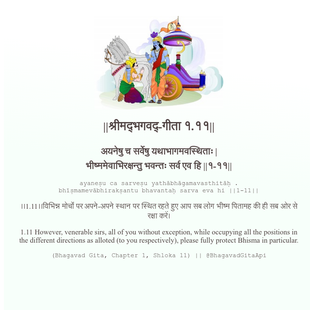

<h2>||श्रीमद्‍भगवद्‍-गीता १.११||</h2>
<h3>अयनेषु च सर्वेषु यथाभागमवस्थिताः | भीष्ममेवाभिरक्षन्तु भवन्तः सर्व एव हि ||१-११||</h3>
<pre>ayaneṣu ca sarveṣu yathābhāgamavasthitāḥ . bhīṣmamevābhirakṣantu bhavantaḥ sarva eva hi ||1-11||</pre>

।।1.11।।विभिन्न मोर्चों पर अपने-अपने स्थान पर स्थित रहते हुए आप सब लोग भीष्म पितामह की ही सब ओर से रक्षा करें।

<pre>(Bhagavad Gita, Chapter 1, Shloka 11) || @BhagavadGitaApi</pre>
https://vedicscriptures.github.io/

#API #bhagavadgitaapi #slok #nodejs #js #api #gitaapi #krishna #hinduism #vedic #ISKCON #shreemadbhagavadgita #technology

