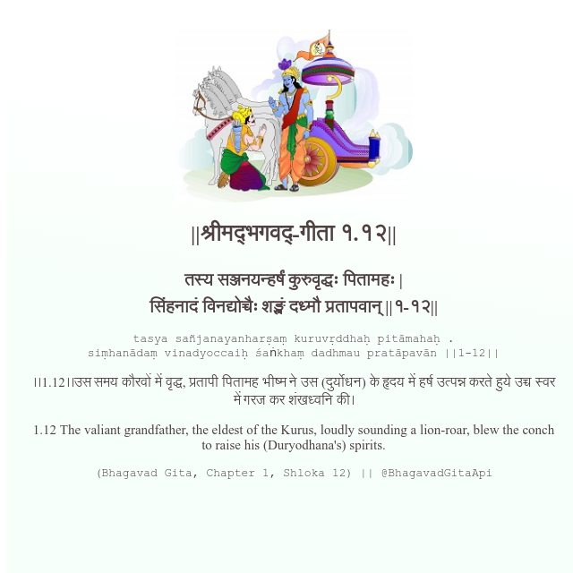

<h2>||श्रीमद्‍भगवद्‍-गीता १.१२||</h2>
<h3>तस्य सञ्जनयन्हर्षं कुरुवृद्धः पितामहः | सिंहनादं विनद्योच्चैः शङ्खं दध्मौ प्रतापवान् ||१-१२||</h3>
<pre>tasya sañjanayanharṣaṃ kuruvṛddhaḥ pitāmahaḥ . siṃhanādaṃ vinadyoccaiḥ śaṅkhaṃ dadhmau pratāpavān ||1-12||</pre>

।।1.12।।उस समय कौरवों में वृद्ध, प्रतापी पितामह भीष्म ने उस (दुर्योधन) के हृदय में हर्ष उत्पन्न करते हुये उच्च स्वर में गरज कर शंखध्वनि की।

<pre>(Bhagavad Gita, Chapter 1, Shloka 12) || @BhagavadGitaApi</pre>
https://bhagavadgitaapi.in/

#API #bhagavadgitaapi #slok #nodejs #js #api #gitaapi #krishna #hinduism #vedic #ISKCON #shreemadbhagavadgita #technology

