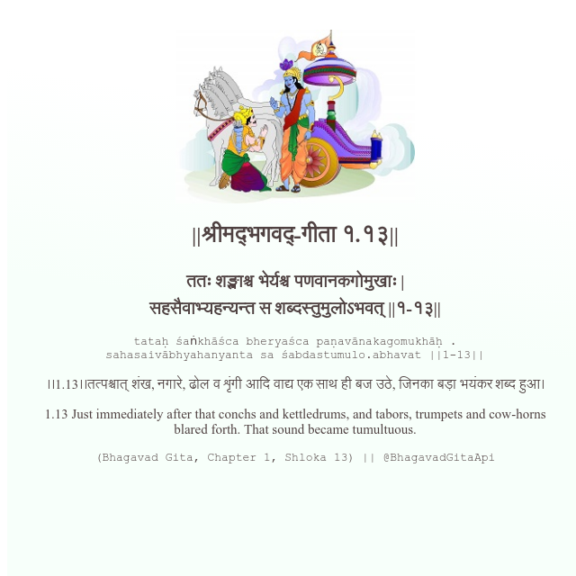

<h2>||श्रीमद्‍भगवद्‍-गीता १.१३||</h2>
<h3>ततः शङ्खाश्च भेर्यश्च पणवानकगोमुखाः | सहसैवाभ्यहन्यन्त स शब्दस्तुमुलोऽभवत् ||१-१३||</h3>
<pre>tataḥ śaṅkhāśca bheryaśca paṇavānakagomukhāḥ . sahasaivābhyahanyanta sa śabdastumulo.abhavat ||1-13||</pre>

।।1.13।।तत्पश्चात् शंख, नगारे, ढोल व शृंगी आदि वाद्य एक साथ ही बज उठे, जिनका बड़ा भयंकर शब्द हुआ।

<pre>(Bhagavad Gita, Chapter 1, Shloka 13) || @BhagavadGitaApi</pre>
https://bhagavadgitaapi.in/

#API #bhagavadgitaapi #slok #nodejs #js #api #gitaapi #krishna #hinduism #vedic #ISKCON #shreemadbhagavadgita #technology

