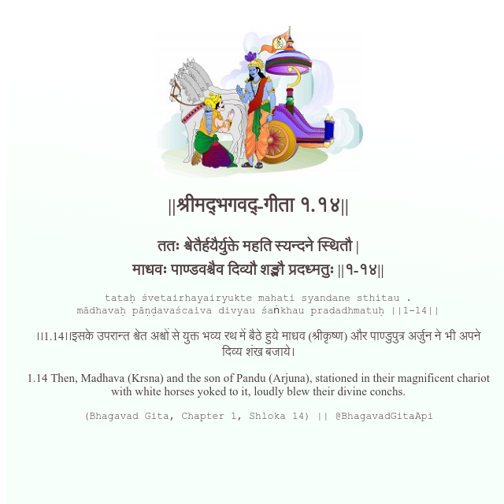

<h2>||श्रीमद्‍भगवद्‍-गीता १.१४||</h2>
<h3>ततः श्वेतैर्हयैर्युक्ते महति स्यन्दने स्थितौ | माधवः पाण्डवश्चैव दिव्यौ शङ्खौ प्रदध्मतुः ||१-१४||</h3>
<pre>tataḥ śvetairhayairyukte mahati syandane sthitau . mādhavaḥ pāṇḍavaścaiva divyau śaṅkhau pradadhmatuḥ ||1-14||</pre>

।।1.14।।इसके उपरान्त श्वेत अश्वों से युक्त भव्य रथ में बैठे हुये माधव (श्रीकृष्ण) और पाण्डुपुत्र अर्जुन ने भी अपने दिव्य शंख बजाये।

<pre>(Bhagavad Gita, Chapter 1, Shloka 14) || @BhagavadGitaApi</pre>
https://bhagavadgitaapi.in/

#API #bhagavadgitaapi #slok #nodejs #js #api #gitaapi #krishna #hinduism #vedic #ISKCON #shreemadbhagavadgita #technology

