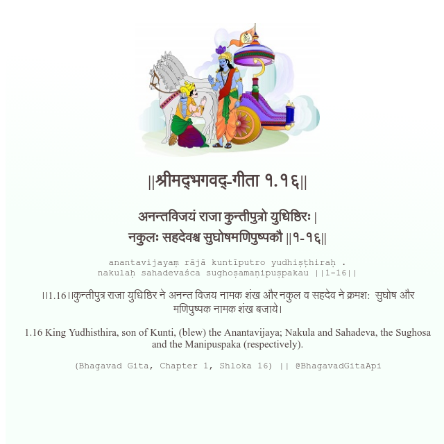

<h2>||श्रीमद्‍भगवद्‍-गीता १.१६||</h2>
<h3>अनन्तविजयं राजा कुन्तीपुत्रो युधिष्ठिरः | नकुलः सहदेवश्च सुघोषमणिपुष्पकौ ||१-१६||</h3>
<pre>anantavijayaṃ rājā kuntīputro yudhiṣṭhiraḥ . nakulaḥ sahadevaśca sughoṣamaṇipuṣpakau ||1-16||</pre>

।।1.16।।कुन्तीपुत्र राजा युधिष्ठिर ने अनन्त विजय नामक शंख और नकुल व सहदेव ने क्रमश:  सुघोष और मणिपुष्पक नामक शंख बजाये।

<pre>(Bhagavad Gita, Chapter 1, Shloka 16) || @BhagavadGitaApi</pre>
https://vedicscriptures.github.io/

#API #bhagavadgitaapi #slok #nodejs #js #api #gitaapi #krishna #hinduism #vedic #ISKCON #shreemadbhagavadgita #technology

