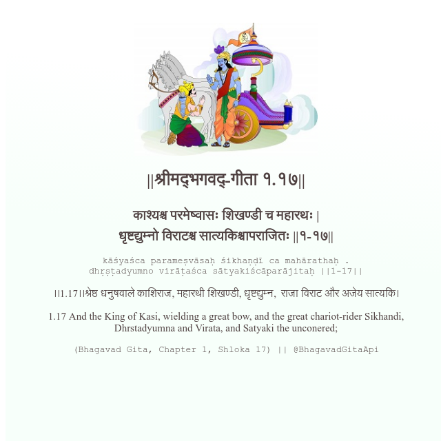

<h2>||श्रीमद्‍भगवद्‍-गीता १.१७||</h2>
<h3>काश्यश्च परमेष्वासः शिखण्डी च महारथः | धृष्टद्युम्नो विराटश्च सात्यकिश्चापराजितः ||१-१७||</h3>
<pre>kāśyaśca parameṣvāsaḥ śikhaṇḍī ca mahārathaḥ . dhṛṣṭadyumno virāṭaśca sātyakiścāparājitaḥ ||1-17||</pre>

।।1.17।।श्रेष्ठ धनुषवाले काशिराज, महारथी शिखण्डी, धृष्टद्युम्न,  राजा विराट और अजेय सात्यकि।

<pre>(Bhagavad Gita, Chapter 1, Shloka 17) || @BhagavadGitaApi</pre>
https://vedicscriptures.github.io/

#API #bhagavadgitaapi #slok #nodejs #js #api #gitaapi #krishna #hinduism #vedic #ISKCON #shreemadbhagavadgita #technology

