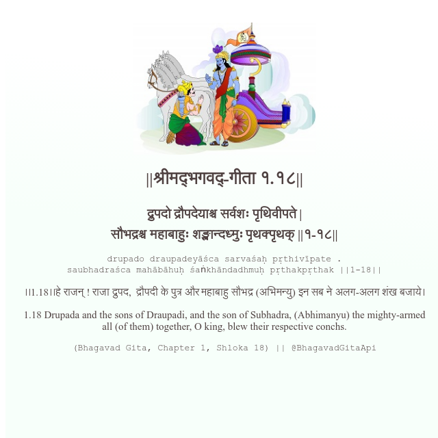

<h2>||श्रीमद्‍भगवद्‍-गीता १.१८||</h2>
<h3>द्रुपदो द्रौपदेयाश्च सर्वशः पृथिवीपते | सौभद्रश्च महाबाहुः शङ्खान्दध्मुः पृथक्पृथक् ||१-१८||</h3>
<pre>drupado draupadeyāśca sarvaśaḥ pṛthivīpate . saubhadraśca mahābāhuḥ śaṅkhāndadhmuḥ pṛthakpṛthak ||1-18||</pre>

।।1.18।।हे राजन् ! राजा द्रुपद,  द्रौपदी के पुत्र और महाबाहु सौभद्र (अभिमन्यु) इन सब ने अलग-अलग शंख बजाये।

<pre>(Bhagavad Gita, Chapter 1, Shloka 18) || @BhagavadGitaApi</pre>
https://vedicscriptures.github.io/

#API #bhagavadgitaapi #slok #nodejs #js #api #gitaapi #krishna #hinduism #vedic #ISKCON #shreemadbhagavadgita #technology

