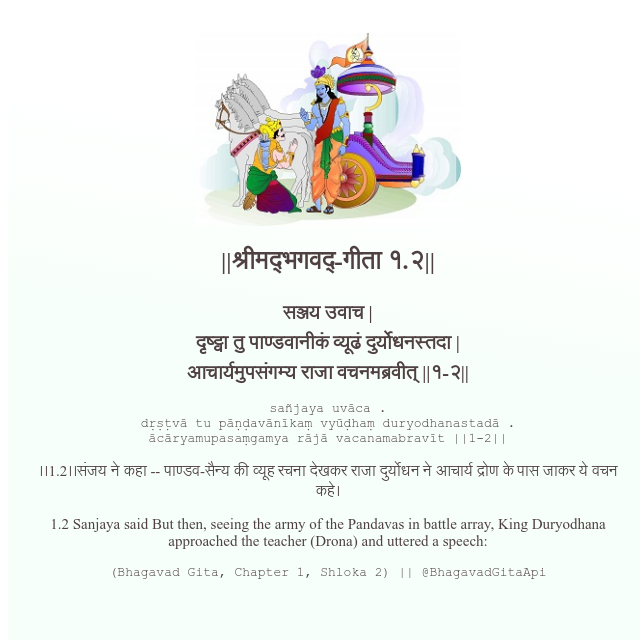

<h2>||श्रीमद्‍भगवद्‍-गीता १.२||</h2>
<h3>सञ्जय उवाच | दृष्ट्वा तु पाण्डवानीकं व्यूढं दुर्योधनस्तदा | आचार्यमुपसंगम्य राजा वचनमब्रवीत् ||१-२||</h3>
<pre>sañjaya uvāca . dṛṣṭvā tu pāṇḍavānīkaṃ vyūḍhaṃ duryodhanastadā . ācāryamupasaṃgamya rājā vacanamabravīt ||1-2||</pre>

।।1.2।।संजय ने कहा -- पाण्डव-सैन्य की व्यूह रचना देखकर राजा दुर्योधन ने आचार्य द्रोण के पास जाकर ये वचन कहे।

<pre>(Bhagavad Gita, Chapter 1, Shloka 2) || @BhagavadGitaApi</pre>
https://docs.bhagavadgitaapi.in/

#API #bhagavadgitaapi #slok #nodejs #js #api #gitaapi #krishna #hinduism #vedic #ISKCON #shreemadbhagavadgita #technology

