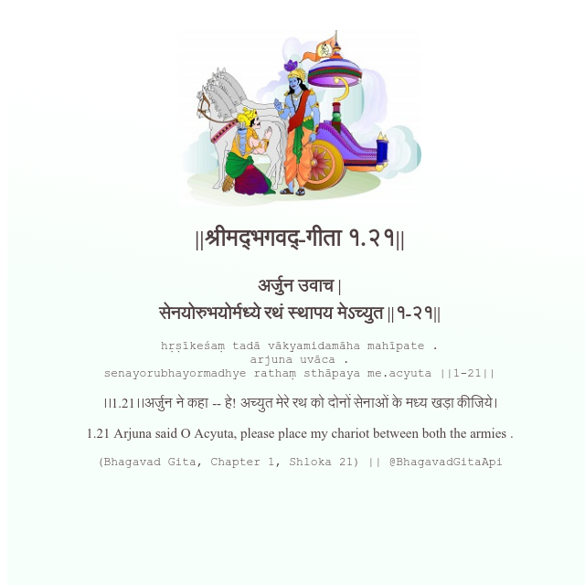

<h2>||श्रीमद्‍भगवद्‍-गीता १.२१||</h2>
<h3>अर्जुन उवाच | सेनयोरुभयोर्मध्ये रथं स्थापय मेऽच्युत ||१-२१||</h3>
<pre>hṛṣīkeśaṃ tadā vākyamidamāha mahīpate . arjuna uvāca . senayorubhayormadhye rathaṃ sthāpaya me.acyuta ||1-21||</pre>

।।1.21।।अर्जुन ने कहा -- हे! अच्युत मेरे रथ को दोनों सेनाओं के मध्य खड़ा कीजिये।

<pre>(Bhagavad Gita, Chapter 1, Shloka 21) || @BhagavadGitaApi</pre>
https://vedicscriptures.github.io/

#API #bhagavadgitaapi #slok #nodejs #js #api #gitaapi #krishna #hinduism #vedic #ISKCON #shreemadbhagavadgita #technology

