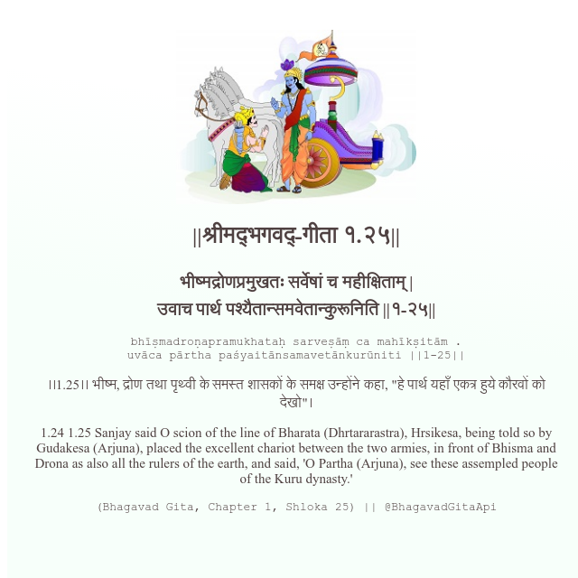

<h2>||श्रीमद्‍भगवद्‍-गीता १.२५||</h2>
<h3>भीष्मद्रोणप्रमुखतः सर्वेषां च महीक्षिताम् | उवाच पार्थ पश्यैतान्समवेतान्कुरूनिति ||१-२५||</h3>
<pre>bhīṣmadroṇapramukhataḥ sarveṣāṃ ca mahīkṣitām . uvāca pārtha paśyaitānsamavetānkurūniti ||1-25||</pre>

।।1.25।। भीष्म, द्रोण तथा पृथ्वी के समस्त शासकों के समक्ष उन्होंने कहा, "हे पार्थ यहाँ एकत्र हुये कौरवों को देखो"।

<pre>(Bhagavad Gita, Chapter 1, Shloka 25) || @BhagavadGitaApi</pre>
https://docs.bhagavadgitaapi.in/

#API #bhagavadgitaapi #slok #nodejs #js #api #gitaapi #krishna #hinduism #vedic #ISKCON #shreemadbhagavadgita #technology

