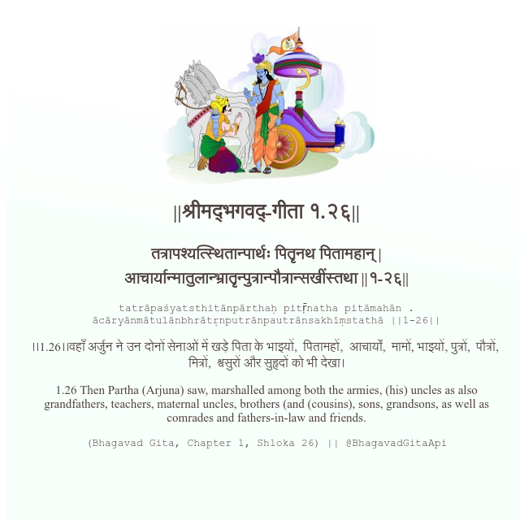

<h2>||श्रीमद्‍भगवद्‍-गीता १.२६||</h2>
<h3>तत्रापश्यत्स्थितान्पार्थः पितॄनथ पितामहान् | आचार्यान्मातुलान्भ्रातॄन्पुत्रान्पौत्रान्सखींस्तथा ||१-२६||</h3>
<pre>tatrāpaśyatsthitānpārthaḥ pitṝnatha pitāmahān . ācāryānmātulānbhrātṛnputrānpautrānsakhīṃstathā ||1-26||</pre>

।।1.26।।वहाँ अर्जुन ने उन दोनों सेनाओं में खड़े पिता के भाइयों,  पितामहों,  आचार्यों,  मामों, भाइयों, पुत्रों,  पौत्रों,  मित्रों,  श्वसुरों और सुहृदों को भी देखा।

<pre>(Bhagavad Gita, Chapter 1, Shloka 26) || @BhagavadGitaApi</pre>
https://docs.bhagavadgitaapi.in/

#API #bhagavadgitaapi #slok #nodejs #js #api #gitaapi #krishna #hinduism #vedic #ISKCON #shreemadbhagavadgita #technology

