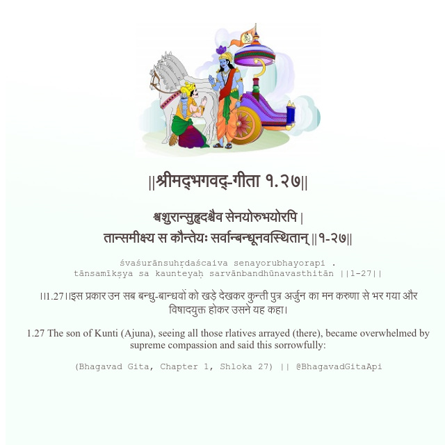

<h2>||श्रीमद्‍भगवद्‍-गीता १.२७||</h2>
<h3>श्वशुरान्सुहृदश्चैव सेनयोरुभयोरपि | तान्समीक्ष्य स कौन्तेयः सर्वान्बन्धूनवस्थितान् ||१-२७||</h3>
<pre>śvaśurānsuhṛdaścaiva senayorubhayorapi . tānsamīkṣya sa kaunteyaḥ sarvānbandhūnavasthitān ||1-27||</pre>

।।1.27।।इस प्रकार उन सब बन्धु-बान्धवों को खड़े देखकर कुन्ती पुत्र अर्जुन का मन करुणा से भर गया और विषादयुक्त होकर उसने यह कहा।

<pre>(Bhagavad Gita, Chapter 1, Shloka 27) || @BhagavadGitaApi</pre>
https://vedicscriptures.github.io/

#API #bhagavadgitaapi #slok #nodejs #js #api #gitaapi #krishna #hinduism #vedic #ISKCON #shreemadbhagavadgita #technology

