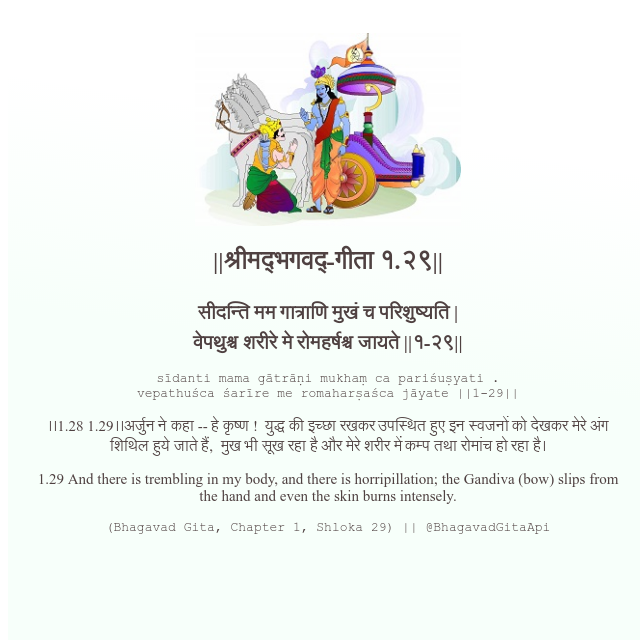

<h2>||श्रीमद्‍भगवद्‍-गीता १.२९||</h2>
<h3>सीदन्ति मम गात्राणि मुखं च परिशुष्यति | वेपथुश्च शरीरे मे रोमहर्षश्च जायते ||१-२९||</h3>
<pre>sīdanti mama gātrāṇi mukhaṃ ca pariśuṣyati . vepathuśca śarīre me romaharṣaśca jāyate ||1-29||</pre>

।।1.28 1.29।।अर्जुन ने कहा -- हे कृष्ण !  युद्ध की इच्छा रखकर उपस्थित हुए इन स्वजनों को देखकर मेरे अंग शिथिल हुये जाते हैं,  मुख भी सूख रहा है और मेरे शरीर में कम्प तथा रोमांच हो रहा है।

<pre>(Bhagavad Gita, Chapter 1, Shloka 29) || @BhagavadGitaApi</pre>
https://docs.bhagavadgitaapi.in/

#API #bhagavadgitaapi #slok #nodejs #js #api #gitaapi #krishna #hinduism #vedic #ISKCON #shreemadbhagavadgita #technology

