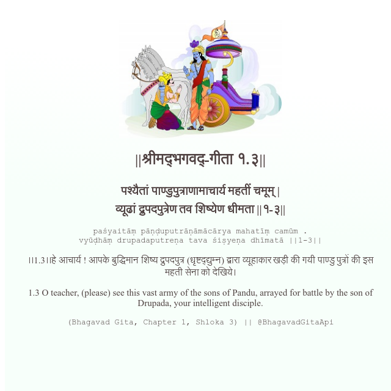

<h2>||श्रीमद्‍भगवद्‍-गीता १.३||</h2>
<h3>पश्यैतां पाण्डुपुत्राणामाचार्य महतीं चमूम् | व्यूढां द्रुपदपुत्रेण तव शिष्येण धीमता ||१-३||</h3>
<pre>paśyaitāṃ pāṇḍuputrāṇāmācārya mahatīṃ camūm . vyūḍhāṃ drupadaputreṇa tava śiṣyeṇa dhīmatā ||1-3||</pre>

।।1.3।।हे आचार्य ! आपके बुद्धिमान शिष्य द्रुपदपुत्र (धृष्टद्द्युम्न) द्वारा व्यूहाकार खड़ी की गयी पाण्डु पुत्रों की इस महती सेना को देखिये।

<pre>(Bhagavad Gita, Chapter 1, Shloka 3) || @BhagavadGitaApi</pre>
https://docs.bhagavadgitaapi.in/

#API #bhagavadgitaapi #slok #nodejs #js #api #gitaapi #krishna #hinduism #vedic #ISKCON #shreemadbhagavadgita #technology

