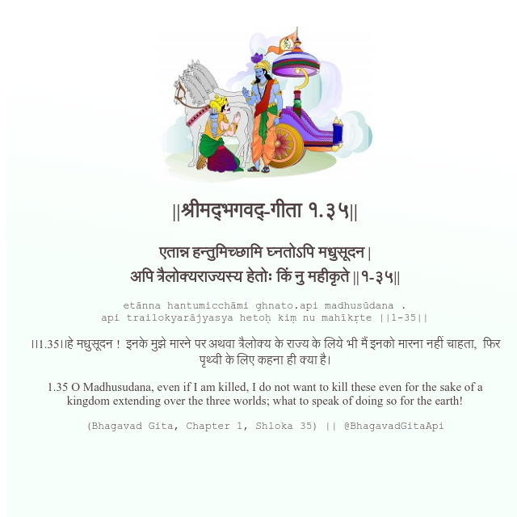

<h2>||श्रीमद्‍भगवद्‍-गीता १.३५||</h2>
<h3>एतान्न हन्तुमिच्छामि घ्नतोऽपि मधुसूदन | अपि त्रैलोक्यराज्यस्य हेतोः किं नु महीकृते ||१-३५||</h3>
<pre>etānna hantumicchāmi ghnato.api madhusūdana . api trailokyarājyasya hetoḥ kiṃ nu mahīkṛte ||1-35||</pre>

।।1.35।।हे मधुसूदन !  इनके मुझे मारने पर अथवा त्रैलोक्य के राज्य के लिये भी मैं इनको मारना नहीं चाहता,  फिर पृथ्वी के लिए कहना ही क्या है।

<pre>(Bhagavad Gita, Chapter 1, Shloka 35) || @BhagavadGitaApi</pre>
https://bhagavadgitaapi.in/

#API #bhagavadgitaapi #slok #nodejs #js #api #gitaapi #krishna #hinduism #vedic #ISKCON #shreemadbhagavadgita #technology

