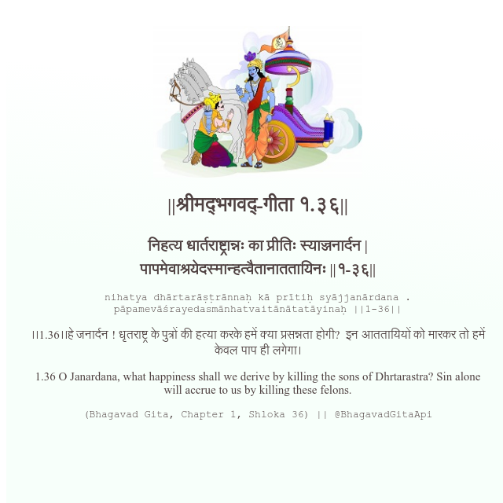

<h2>||श्रीमद्‍भगवद्‍-गीता १.३६||</h2>
<h3>निहत्य धार्तराष्ट्रान्नः का प्रीतिः स्याज्जनार्दन | पापमेवाश्रयेदस्मान्हत्वैतानाततायिनः ||१-३६||</h3>
<pre>nihatya dhārtarāṣṭrānnaḥ kā prītiḥ syājjanārdana . pāpamevāśrayedasmānhatvaitānātatāyinaḥ ||1-36||</pre>

।।1.36।।हे जनार्दन ! धृतराष्ट्र के पुत्रों की हत्या करके हमें क्या प्रसन्नता होगी?  इन आततायियों को मारकर तो हमें केवल पाप ही लगेगा।

<pre>(Bhagavad Gita, Chapter 1, Shloka 36) || @BhagavadGitaApi</pre>
https://docs.bhagavadgitaapi.in/

#API #bhagavadgitaapi #slok #nodejs #js #api #gitaapi #krishna #hinduism #vedic #ISKCON #shreemadbhagavadgita #technology

