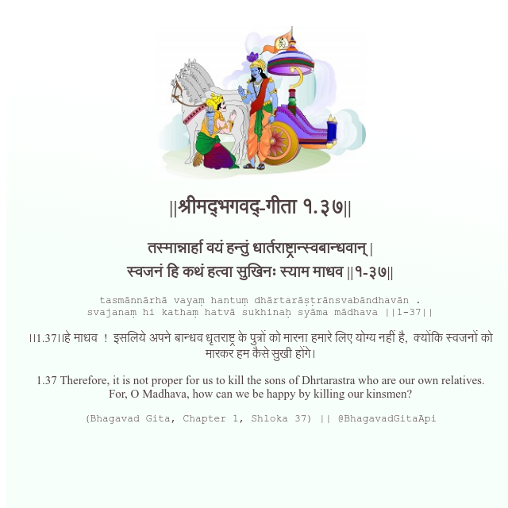

<h2>||श्रीमद्‍भगवद्‍-गीता १.३७||</h2>
<h3>तस्मान्नार्हा वयं हन्तुं धार्तराष्ट्रान्स्वबान्धवान् | स्वजनं हि कथं हत्वा सुखिनः स्याम माधव ||१-३७||</h3>
<pre>tasmānnārhā vayaṃ hantuṃ dhārtarāṣṭrānsvabāndhavān . svajanaṃ hi kathaṃ hatvā sukhinaḥ syāma mādhava ||1-37||</pre>

।।1.37।।हे माधव  !  इसलिये अपने बान्धव धृतराष्ट्र के पुत्रों को मारना हमारे लिए योग्य नहीं है,  क्योंकि स्वजनों को मारकर हम कैसे सुखी होंगे।

<pre>(Bhagavad Gita, Chapter 1, Shloka 37) || @BhagavadGitaApi</pre>
https://vedicscriptures.github.io/

#API #bhagavadgitaapi #slok #nodejs #js #api #gitaapi #krishna #hinduism #vedic #ISKCON #shreemadbhagavadgita #technology

