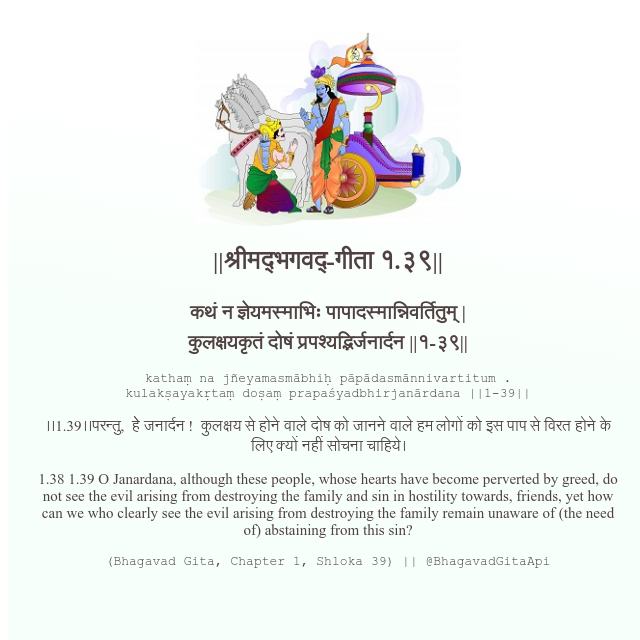

<h2>||श्रीमद्‍भगवद्‍-गीता १.३९||</h2>
<h3>कथं न ज्ञेयमस्माभिः पापादस्मान्निवर्तितुम् | कुलक्षयकृतं दोषं प्रपश्यद्भिर्जनार्दन ||१-३९||</h3>
<pre>kathaṃ na jñeyamasmābhiḥ pāpādasmānnivartitum . kulakṣayakṛtaṃ doṣaṃ prapaśyadbhirjanārdana ||1-39||</pre>

।।1.39।।परन्तु,  हेे जनार्दन !  कुलक्षय से होने वाले दोष को जानने वाले हम लोगों को इस पाप से विरत होने के लिए क्यों नहीं सोचना चाहिये।

<pre>(Bhagavad Gita, Chapter 1, Shloka 39) || @BhagavadGitaApi</pre>
https://docs.bhagavadgitaapi.in/

#API #bhagavadgitaapi #slok #nodejs #js #api #gitaapi #krishna #hinduism #vedic #ISKCON #shreemadbhagavadgita #technology

