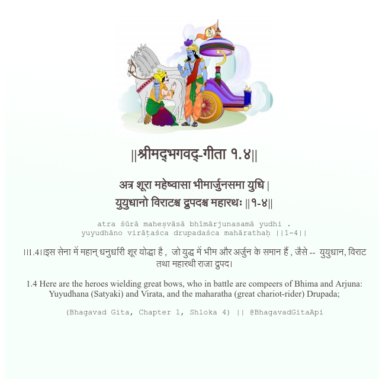

<h2>||श्रीमद्‍भगवद्‍-गीता १.४||</h2>
<h3>अत्र शूरा महेष्वासा भीमार्जुनसमा युधि | युयुधानो विराटश्च द्रुपदश्च महारथः ||१-४||</h3>
<pre>atra śūrā maheṣvāsā bhīmārjunasamā yudhi . yuyudhāno virāṭaśca drupadaśca mahārathaḥ ||1-4||</pre>

।।1.4।।इस सेना में महान् धनुर्धारी शूर योद्धा है ,  जो युद्ध में भीम और अर्जुन के समान हैं , जैसे --  युयुधान, विराट तथा महारथी राजा द्रुपद।

<pre>(Bhagavad Gita, Chapter 1, Shloka 4) || @BhagavadGitaApi</pre>
https://vedicscriptures.github.io/

#API #bhagavadgitaapi #slok #nodejs #js #api #gitaapi #krishna #hinduism #vedic #ISKCON #shreemadbhagavadgita #technology

