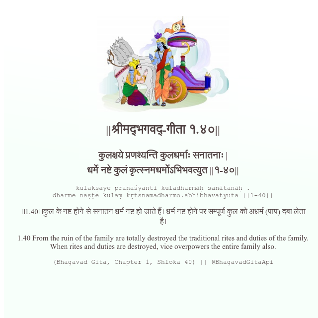

<h2>||श्रीमद्‍भगवद्‍-गीता १.४०||</h2>
<h3>कुलक्षये प्रणश्यन्ति कुलधर्माः सनातनाः | धर्मे नष्टे कुलं कृत्स्नमधर्मोऽभिभवत्युत ||१-४०||</h3>
<pre>kulakṣaye praṇaśyanti kuladharmāḥ sanātanāḥ . dharme naṣṭe kulaṃ kṛtsnamadharmo.abhibhavatyuta ||1-40||</pre>

।।1.40।।कुल के नष्ट होने से सनातन धर्म नष्ट हो जाते हैं। धर्म नष्ट होने पर सम्पूर्ण कुल को अधर्म (पाप) दबा लेता है।

<pre>(Bhagavad Gita, Chapter 1, Shloka 40) || @BhagavadGitaApi</pre>
https://vedicscriptures.github.io/

#API #bhagavadgitaapi #slok #nodejs #js #api #gitaapi #krishna #hinduism #vedic #ISKCON #shreemadbhagavadgita #technology

