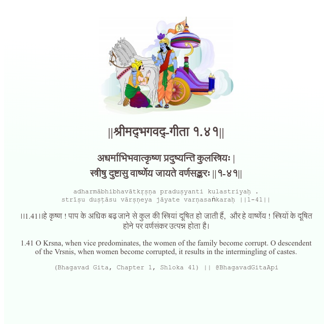

<h2>||श्रीमद्‍भगवद्‍-गीता १.४१||</h2>
<h3>अधर्माभिभवात्कृष्ण प्रदुष्यन्ति कुलस्त्रियः | स्त्रीषु दुष्टासु वार्ष्णेय जायते वर्णसङ्करः ||१-४१||</h3>
<pre>adharmābhibhavātkṛṣṇa praduṣyanti kulastriyaḥ . strīṣu duṣṭāsu vārṣṇeya jāyate varṇasaṅkaraḥ ||1-41||</pre>

।।1.41।।हे कृष्ण ! पाप के अधिक बढ़ जाने से कुल की स्त्रियां दूषित हो जाती हैं,  और हे वार्ष्णेय ! स्त्रियों के दूषित होने पर वर्णसंकर उत्पन्न होता है।

<pre>(Bhagavad Gita, Chapter 1, Shloka 41) || @BhagavadGitaApi</pre>
https://vedicscriptures.github.io/

#API #bhagavadgitaapi #slok #nodejs #js #api #gitaapi #krishna #hinduism #vedic #ISKCON #shreemadbhagavadgita #technology

