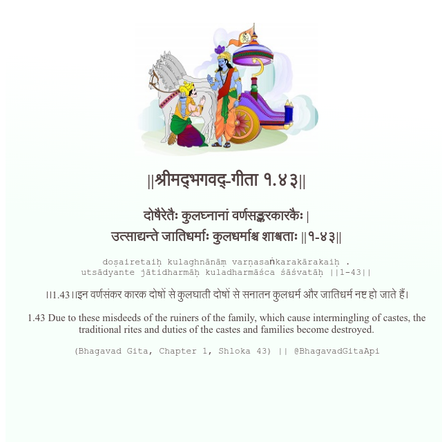

<h2>||श्रीमद्‍भगवद्‍-गीता १.४३||</h2>
<h3>दोषैरेतैः कुलघ्नानां वर्णसङ्करकारकैः | उत्साद्यन्ते जातिधर्माः कुलधर्माश्च शाश्वताः ||१-४३||</h3>
<pre>doṣairetaiḥ kulaghnānāṃ varṇasaṅkarakārakaiḥ . utsādyante jātidharmāḥ kuladharmāśca śāśvatāḥ ||1-43||</pre>

।।1.43।।इन वर्णसंकर कारक दोषों से कुलघाती दोषों से सनातन कुलधर्म और जातिधर्म नष्ट हो जाते हैं।

<pre>(Bhagavad Gita, Chapter 1, Shloka 43) || @BhagavadGitaApi</pre>
https://vedicscriptures.github.io/

#API #bhagavadgitaapi #slok #nodejs #js #api #gitaapi #krishna #hinduism #vedic #ISKCON #shreemadbhagavadgita #technology

