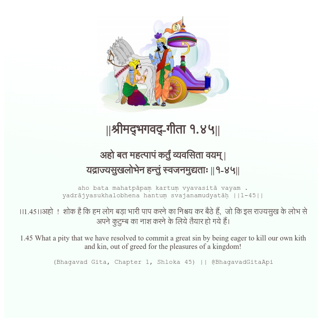

<h2>||श्रीमद्‍भगवद्‍-गीता १.४५||</h2>
<h3>अहो बत महत्पापं कर्तुं व्यवसिता वयम् | यद्राज्यसुखलोभेन हन्तुं स्वजनमुद्यताः ||१-४५||</h3>
<pre>aho bata mahatpāpaṃ kartuṃ vyavasitā vayam . yadrājyasukhalobhena hantuṃ svajanamudyatāḥ ||1-45||</pre>

।।1.45।।अहो  !  शोक है कि हम लोग बड़ा भारी पाप करने का निश्चय कर बैठे हैं,  जो कि इस राज्यसुख के लोभ से अपने कुटुम्ब का नाश करने के लिये तैयार हो गये हैं।

<pre>(Bhagavad Gita, Chapter 1, Shloka 45) || @BhagavadGitaApi</pre>
https://bhagavadgitaapi.in/

#API #bhagavadgitaapi #slok #nodejs #js #api #gitaapi #krishna #hinduism #vedic #ISKCON #shreemadbhagavadgita #technology

