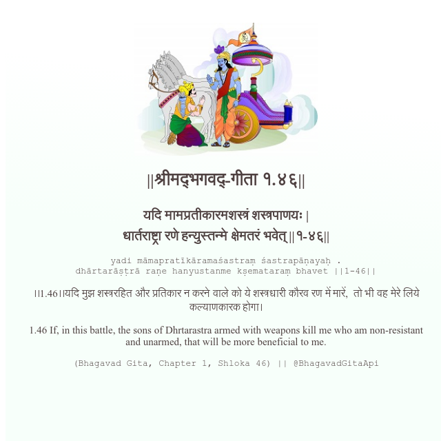

<h2>||श्रीमद्‍भगवद्‍-गीता १.४६||</h2>
<h3>यदि मामप्रतीकारमशस्त्रं शस्त्रपाणयः | धार्तराष्ट्रा रणे हन्युस्तन्मे क्षेमतरं भवेत् ||१-४६||</h3>
<pre>yadi māmapratīkāramaśastraṃ śastrapāṇayaḥ . dhārtarāṣṭrā raṇe hanyustanme kṣemataraṃ bhavet ||1-46||</pre>

।।1.46।।यदि मुझ शस्त्ररहित और प्रतिकार न करने वाले को ये शस्त्रधारी कौरव रण में मारें,  तो भी वह मेरे लिये कल्याणकारक होगा।

<pre>(Bhagavad Gita, Chapter 1, Shloka 46) || @BhagavadGitaApi</pre>
https://docs.bhagavadgitaapi.in/

#API #bhagavadgitaapi #slok #nodejs #js #api #gitaapi #krishna #hinduism #vedic #ISKCON #shreemadbhagavadgita #technology

