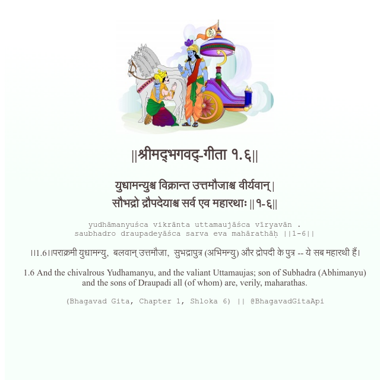

<h2>||श्रीमद्‍भगवद्‍-गीता १.६||</h2>
<h3>युधामन्युश्च विक्रान्त उत्तमौजाश्च वीर्यवान् | सौभद्रो द्रौपदेयाश्च सर्व एव महारथाः ||१-६||</h3>
<pre>yudhāmanyuśca vikrānta uttamaujāśca vīryavān . saubhadro draupadeyāśca sarva eva mahārathāḥ ||1-6||</pre>

।।1.6।।पराक्रमी युधामन्यु,  बलवान् उत्तमौजा,  सुभद्रापुत्र (अभिमन्यु) और द्रोपदी के पुत्र -- ये सब महारथी हैं।

<pre>(Bhagavad Gita, Chapter 1, Shloka 6) || @BhagavadGitaApi</pre>
https://vedicscriptures.github.io/

#API #bhagavadgitaapi #slok #nodejs #js #api #gitaapi #krishna #hinduism #vedic #ISKCON #shreemadbhagavadgita #technology

