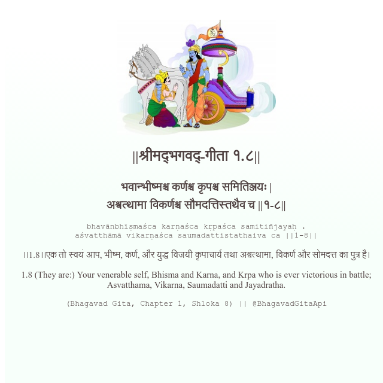

<h2>||श्रीमद्‍भगवद्‍-गीता १.८||</h2>
<h3>भवान्भीष्मश्च कर्णश्च कृपश्च समितिञ्जयः | अश्वत्थामा विकर्णश्च सौमदत्तिस्तथैव च ||१-८||</h3>
<pre>bhavānbhīṣmaśca karṇaśca kṛpaśca samitiñjayaḥ . aśvatthāmā vikarṇaśca saumadattistathaiva ca ||1-8||</pre>

।।1.8।।एक तो स्वयं आप, भीष्म, कर्ण, और युद्ध विजयी कृपाचार्य तथा अश्वत्थामा, विकर्ण और सोमदत्त का पुत्र है।

<pre>(Bhagavad Gita, Chapter 1, Shloka 8) || @BhagavadGitaApi</pre>
https://vedicscriptures.github.io/

#API #bhagavadgitaapi #slok #nodejs #js #api #gitaapi #krishna #hinduism #vedic #ISKCON #shreemadbhagavadgita #technology

