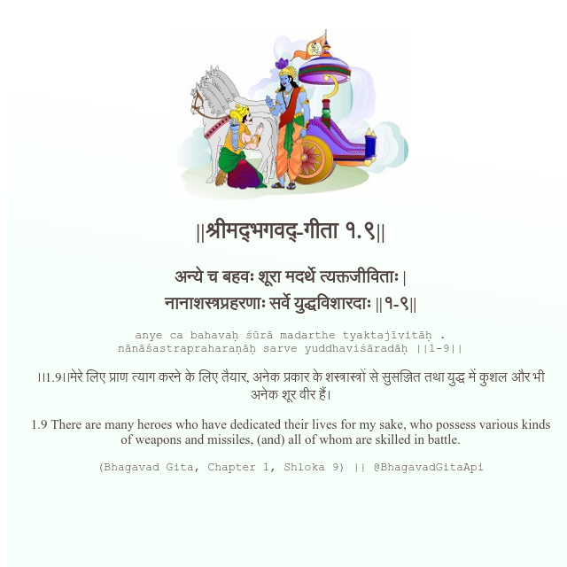

<h2>||श्रीमद्‍भगवद्‍-गीता १.९||</h2>
<h3>अन्ये च बहवः शूरा मदर्थे त्यक्तजीविताः | नानाशस्त्रप्रहरणाः सर्वे युद्धविशारदाः ||१-९||</h3>
<pre>anye ca bahavaḥ śūrā madarthe tyaktajīvitāḥ . nānāśastrapraharaṇāḥ sarve yuddhaviśāradāḥ ||1-9||</pre>

।।1.9।।मेरे लिए प्राण त्याग करने के लिए तैयार, अनेक प्रकार के शस्त्रास्त्रों से सुसज्जित तथा युद्ध में कुशल और भी अनेक शूर वीर हैं।

<pre>(Bhagavad Gita, Chapter 1, Shloka 9) || @BhagavadGitaApi</pre>
https://bhagavadgitaapi.in/

#API #bhagavadgitaapi #slok #nodejs #js #api #gitaapi #krishna #hinduism #vedic #ISKCON #shreemadbhagavadgita #technology

