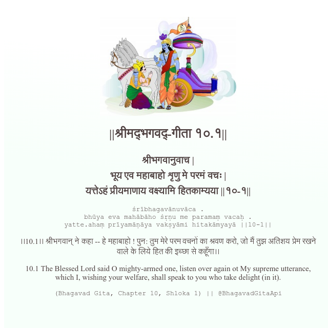

<h2>||श्रीमद्‍भगवद्‍-गीता १०.१||</h2>
<h3>श्रीभगवानुवाच | भूय एव महाबाहो शृणु मे परमं वचः | यत्तेऽहं प्रीयमाणाय वक्ष्यामि हितकाम्यया ||१०-१||</h3>
<pre>śrībhagavānuvāca . bhūya eva mahābāho śṛṇu me paramaṃ vacaḥ . yatte.ahaṃ prīyamāṇāya vakṣyāmi hitakāmyayā ||10-1||</pre>

।।10.1।। श्रीभगवान् ने कहा -- हे महाबाहो ! पुन: तुम मेरे परम वचनों का श्रवण करो, जो मैं तुझ अतिशय प्रेम रखने वाले के लिये हित की इच्छा से कहूँगा।।

<pre>(Bhagavad Gita, Chapter 10, Shloka 1) || @BhagavadGitaApi</pre>
https://docs.bhagavadgitaapi.in/

#API #bhagavadgitaapi #slok #nodejs #js #api #gitaapi #krishna #hinduism #vedic #ISKCON #shreemadbhagavadgita #technology

