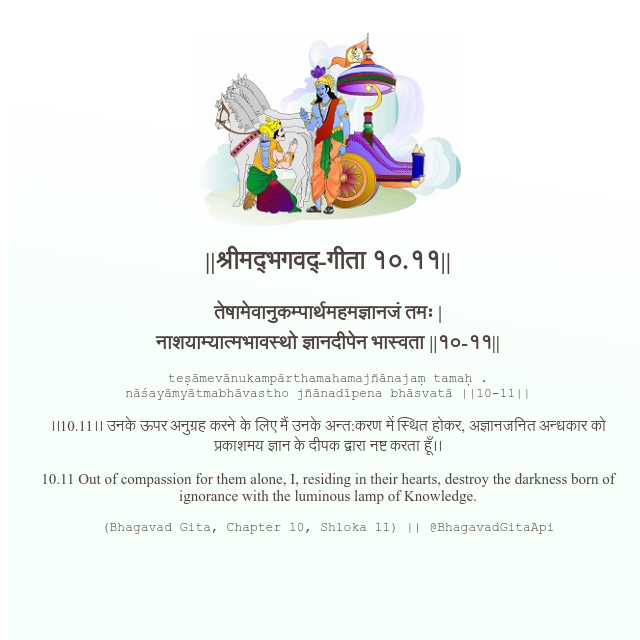

<h2>||श्रीमद्‍भगवद्‍-गीता १०.११||</h2>
<h3>तेषामेवानुकम्पार्थमहमज्ञानजं तमः | नाशयाम्यात्मभावस्थो ज्ञानदीपेन भास्वता ||१०-११||</h3>
<pre>teṣāmevānukampārthamahamajñānajaṃ tamaḥ . nāśayāmyātmabhāvastho jñānadīpena bhāsvatā ||10-11||</pre>

।।10.11।। उनके ऊपर अनुग्रह करने के लिए मैं उनके अन्त:करण में स्थित होकर, अज्ञानजनित अन्धकार को प्रकाशमय ज्ञान के दीपक द्वारा नष्ट करता हूँ।।

<pre>(Bhagavad Gita, Chapter 10, Shloka 11) || @BhagavadGitaApi</pre>
https://docs.bhagavadgitaapi.in/

#API #bhagavadgitaapi #slok #nodejs #js #api #gitaapi #krishna #hinduism #vedic #ISKCON #shreemadbhagavadgita #technology

