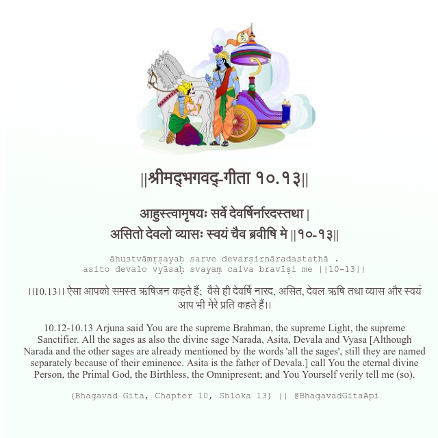

<h2>||श्रीमद्‍भगवद्‍-गीता १०.१३||</h2>
<h3>आहुस्त्वामृषयः सर्वे देवर्षिर्नारदस्तथा | असितो देवलो व्यासः स्वयं चैव ब्रवीषि मे ||१०-१३||</h3>
<pre>āhustvāmṛṣayaḥ sarve devarṣirnāradastathā . asito devalo vyāsaḥ svayaṃ caiva bravīṣi me ||10-13||</pre>

।।10.13।। ऐसा आपको समस्त ऋषिजन कहते हैं;  वैसे ही देवर्षि नारद, असित, देवल ऋषि तथा व्यास और स्वयं आप भी मेरे प्रति कहते हैं।।

<pre>(Bhagavad Gita, Chapter 10, Shloka 13) || @BhagavadGitaApi</pre>
https://docs.bhagavadgitaapi.in/

#API #bhagavadgitaapi #slok #nodejs #js #api #gitaapi #krishna #hinduism #vedic #ISKCON #shreemadbhagavadgita #technology

