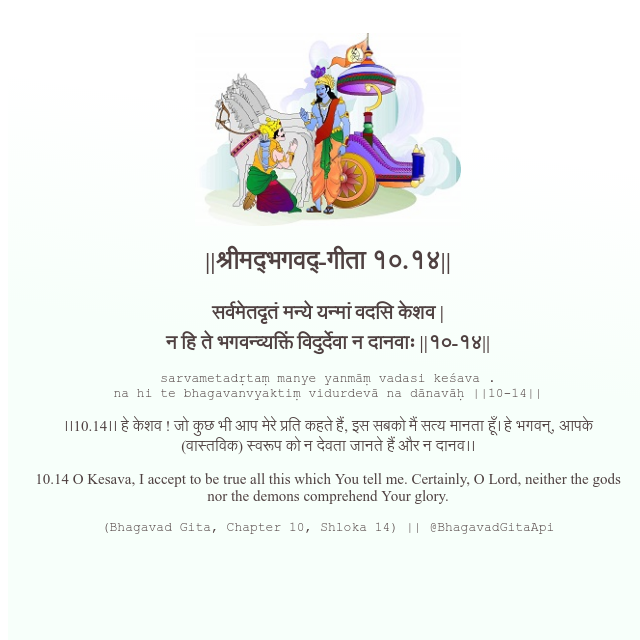

<h2>||श्रीमद्‍भगवद्‍-गीता १०.१४||</h2>
<h3>सर्वमेतदृतं मन्ये यन्मां वदसि केशव | न हि ते भगवन्व्यक्तिं विदुर्देवा न दानवाः ||१०-१४||</h3>
<pre>sarvametadṛtaṃ manye yanmāṃ vadasi keśava . na hi te bhagavanvyaktiṃ vidurdevā na dānavāḥ ||10-14||</pre>

।।10.14।। हे केशव ! जो कुछ भी आप मेरे प्रति कहते हैं, इस सबको मैं सत्य मानता हूँ। हे भगवन्, आपके (वास्तविक) स्वरूप को न देवता जानते हैं और न दानव।।

<pre>(Bhagavad Gita, Chapter 10, Shloka 14) || @BhagavadGitaApi</pre>
https://vedicscriptures.github.io/

#API #bhagavadgitaapi #slok #nodejs #js #api #gitaapi #krishna #hinduism #vedic #ISKCON #shreemadbhagavadgita #technology

