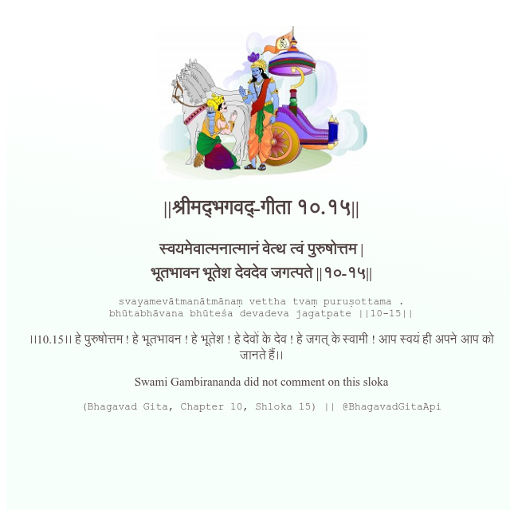

<h2>||श्रीमद्‍भगवद्‍-गीता १०.१५||</h2>
<h3>स्वयमेवात्मनात्मानं वेत्थ त्वं पुरुषोत्तम | भूतभावन भूतेश देवदेव जगत्पते ||१०-१५||</h3>
<pre>svayamevātmanātmānaṃ vettha tvaṃ puruṣottama . bhūtabhāvana bhūteśa devadeva jagatpate ||10-15||</pre>

।।10.15।। हे पुरुषोत्तम ! हे भूतभावन ! हे भूतेश ! हे देवों के देव ! हे जगत् के स्वामी ! आप स्वयं ही अपने आप को जानते हैं।।

<pre>(Bhagavad Gita, Chapter 10, Shloka 15) || @BhagavadGitaApi</pre>
https://vedicscriptures.github.io/

#API #bhagavadgitaapi #slok #nodejs #js #api #gitaapi #krishna #hinduism #vedic #ISKCON #shreemadbhagavadgita #technology

