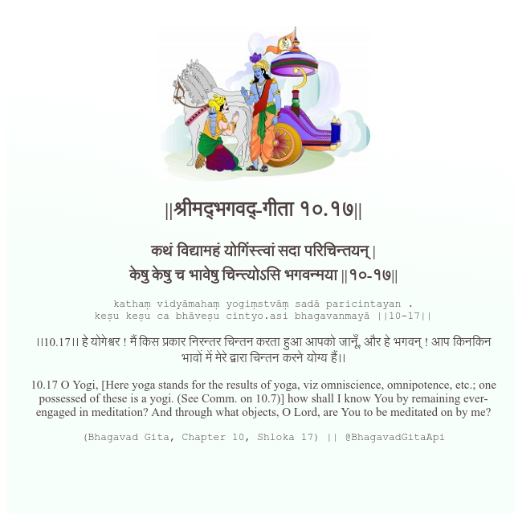

<h2>||श्रीमद्‍भगवद्‍-गीता १०.१७||</h2>
<h3>कथं विद्यामहं योगिंस्त्वां सदा परिचिन्तयन् | केषु केषु च भावेषु चिन्त्योऽसि भगवन्मया ||१०-१७||</h3>
<pre>kathaṃ vidyāmahaṃ yogiṃstvāṃ sadā paricintayan . keṣu keṣu ca bhāveṣu cintyo.asi bhagavanmayā ||10-17||</pre>

।।10.17।। हे योगेश्वर ! मैं किस प्रकार निरन्तर चिन्तन करता हुआ आपको जानूँ, और हे भगवन् ! आप किनकिन भावों में मेरे द्वारा चिन्तन करने योग्य हैं।।

<pre>(Bhagavad Gita, Chapter 10, Shloka 17) || @BhagavadGitaApi</pre>
https://docs.bhagavadgitaapi.in/

#API #bhagavadgitaapi #slok #nodejs #js #api #gitaapi #krishna #hinduism #vedic #ISKCON #shreemadbhagavadgita #technology

