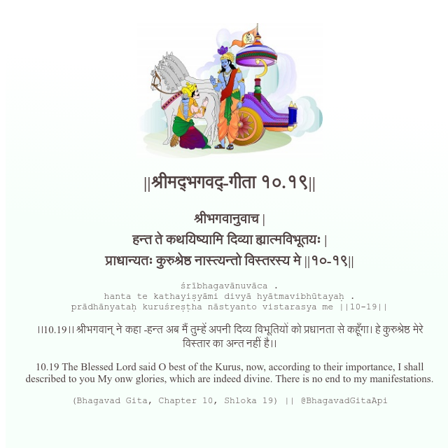

<h2>||श्रीमद्‍भगवद्‍-गीता १०.१९||</h2>
<h3>श्रीभगवानुवाच | हन्त ते कथयिष्यामि दिव्या ह्यात्मविभूतयः | प्राधान्यतः कुरुश्रेष्ठ नास्त्यन्तो विस्तरस्य मे ||१०-१९||</h3>
<pre>śrībhagavānuvāca . hanta te kathayiṣyāmi divyā hyātmavibhūtayaḥ . prādhānyataḥ kuruśreṣṭha nāstyanto vistarasya me ||10-19||</pre>

।।10.19।। श्रीभगवान् ने कहा -हन्त अब मैं तुम्हें अपनी दिव्य विभूतियों को प्रधानता से कहूँगा। हे कुरुश्रेष्ठ मेरे विस्तार का अन्त नहीं है।।

<pre>(Bhagavad Gita, Chapter 10, Shloka 19) || @BhagavadGitaApi</pre>
https://vedicscriptures.github.io/

#API #bhagavadgitaapi #slok #nodejs #js #api #gitaapi #krishna #hinduism #vedic #ISKCON #shreemadbhagavadgita #technology

