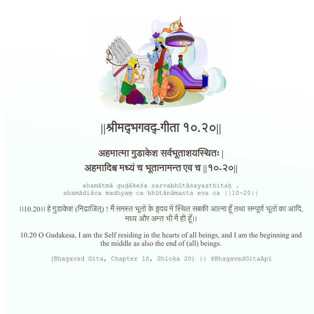

<h2>||श्रीमद्‍भगवद्‍-गीता १०.२०||</h2>
<h3>अहमात्मा गुडाकेश सर्वभूताशयस्थितः | अहमादिश्च मध्यं च भूतानामन्त एव च ||१०-२०||</h3>
<pre>ahamātmā guḍākeśa sarvabhūtāśayasthitaḥ . ahamādiśca madhyaṃ ca bhūtānāmanta eva ca ||10-20||</pre>

।।10.20।। हे गुडाकेश (निद्राजित्) ! मैं समस्त भूतों के हृदय में स्थित सबकी आत्मा हूँ तथा सम्पूर्ण भूतों का आदि, मध्य और अन्त भी मैं ही हूँ।।

<pre>(Bhagavad Gita, Chapter 10, Shloka 20) || @BhagavadGitaApi</pre>
https://docs.bhagavadgitaapi.in/

#API #bhagavadgitaapi #slok #nodejs #js #api #gitaapi #krishna #hinduism #vedic #ISKCON #shreemadbhagavadgita #technology

