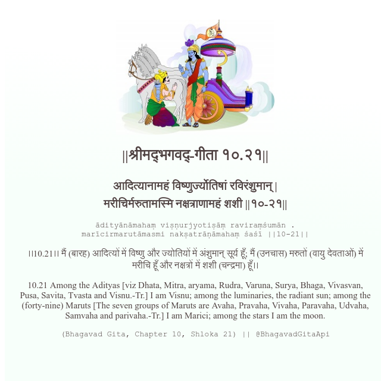

<h2>||श्रीमद्‍भगवद्‍-गीता १०.२१||</h2>
<h3>आदित्यानामहं विष्णुर्ज्योतिषां रविरंशुमान् | मरीचिर्मरुतामस्मि नक्षत्राणामहं शशी ||१०-२१||</h3>
<pre>ādityānāmahaṃ viṣṇurjyotiṣāṃ raviraṃśumān . marīcirmarutāmasmi nakṣatrāṇāmahaṃ śaśī ||10-21||</pre>

।।10.21।। मैं (बारह) आदित्यों में विष्णु और ज्योतियों में अंशुमान् सूर्य हूँ; मैं (उनचास) मरुतों (वायु देवताओं) में मरीचि हूँ और नक्षत्रों में शशी (चन्द्रमा) हूँ।।

<pre>(Bhagavad Gita, Chapter 10, Shloka 21) || @BhagavadGitaApi</pre>
https://vedicscriptures.github.io/

#API #bhagavadgitaapi #slok #nodejs #js #api #gitaapi #krishna #hinduism #vedic #ISKCON #shreemadbhagavadgita #technology

