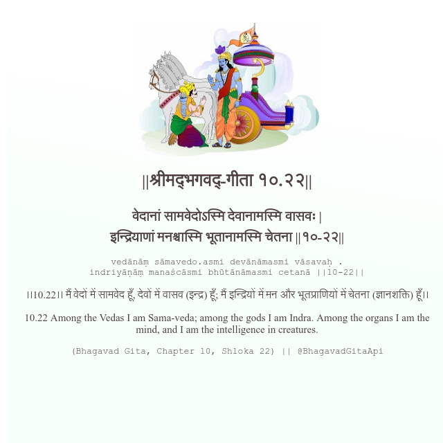

<h2>||श्रीमद्‍भगवद्‍-गीता १०.२२||</h2>
<h3>वेदानां सामवेदोऽस्मि देवानामस्मि वासवः | इन्द्रियाणां मनश्चास्मि भूतानामस्मि चेतना ||१०-२२||</h3>
<pre>vedānāṃ sāmavedo.asmi devānāmasmi vāsavaḥ . indriyāṇāṃ manaścāsmi bhūtānāmasmi cetanā ||10-22||</pre>

।।10.22।। मैं वेदों में सामवेद हूँ, देवों में वासव (इन्द्र) हूँ; मैं इन्द्रियों में मन और भूतप्राणियों में चेतना (ज्ञानशक्ति) हूँ।।

<pre>(Bhagavad Gita, Chapter 10, Shloka 22) || @BhagavadGitaApi</pre>
https://docs.bhagavadgitaapi.in/

#API #bhagavadgitaapi #slok #nodejs #js #api #gitaapi #krishna #hinduism #vedic #ISKCON #shreemadbhagavadgita #technology

