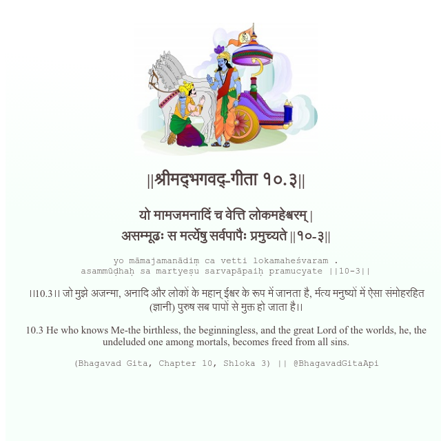

<h2>||श्रीमद्‍भगवद्‍-गीता १०.३||</h2>
<h3>यो मामजमनादिं च वेत्ति लोकमहेश्वरम् | असम्मूढः स मर्त्येषु सर्वपापैः प्रमुच्यते ||१०-३||</h3>
<pre>yo māmajamanādiṃ ca vetti lokamaheśvaram . asammūḍhaḥ sa martyeṣu sarvapāpaiḥ pramucyate ||10-3||</pre>

।।10.3।। जो मुझे अजन्मा, अनादि और लोकों के महान् ईश्वर के रूप में जानता है, र्मत्य मनुष्यों में ऐसा संमोहरहित (ज्ञानी) पुरुष सब पापों से मुक्त हो जाता है।।

<pre>(Bhagavad Gita, Chapter 10, Shloka 3) || @BhagavadGitaApi</pre>
https://docs.bhagavadgitaapi.in/

#API #bhagavadgitaapi #slok #nodejs #js #api #gitaapi #krishna #hinduism #vedic #ISKCON #shreemadbhagavadgita #technology

