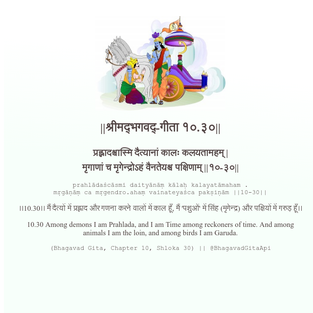

<h2>||श्रीमद्‍भगवद्‍-गीता १०.३०||</h2>
<h3>प्रह्लादश्चास्मि दैत्यानां कालः कलयतामहम् | मृगाणां च मृगेन्द्रोऽहं वैनतेयश्च पक्षिणाम् ||१०-३०||</h3>
<pre>prahlādaścāsmi daityānāṃ kālaḥ kalayatāmaham . mṛgāṇāṃ ca mṛgendro.ahaṃ vainateyaśca pakṣiṇām ||10-30||</pre>

।।10.30।। मैं दैत्यों में प्रह्लाद और गणना करने वालों में काल हूँ, मैं 'पशुओं' में सिंह (मृगेन्द्र) और पक्षियों में गरुड़ हूँ।।

<pre>(Bhagavad Gita, Chapter 10, Shloka 30) || @BhagavadGitaApi</pre>
https://bhagavadgitaapi.in/

#API #bhagavadgitaapi #slok #nodejs #js #api #gitaapi #krishna #hinduism #vedic #ISKCON #shreemadbhagavadgita #technology

