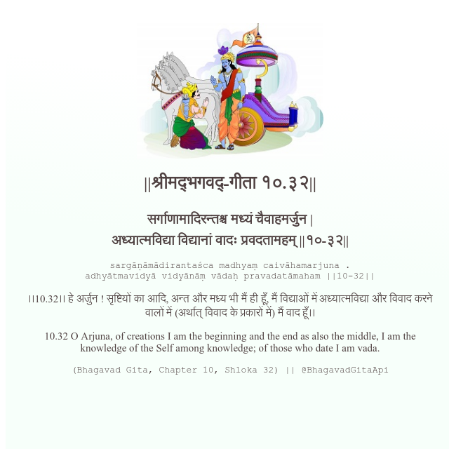

<h2>||श्रीमद्‍भगवद्‍-गीता १०.३२||</h2>
<h3>सर्गाणामादिरन्तश्च मध्यं चैवाहमर्जुन | अध्यात्मविद्या विद्यानां वादः प्रवदतामहम् ||१०-३२||</h3>
<pre>sargāṇāmādirantaśca madhyaṃ caivāhamarjuna . adhyātmavidyā vidyānāṃ vādaḥ pravadatāmaham ||10-32||</pre>

।।10.32।। हे अर्जुन ! सृष्टियों का आदि, अन्त और मध्य भी मैं ही हूँ, मैं विद्याओं में अध्यात्मविद्या और विवाद करने वालों में (अर्थात् विवाद के प्रकारों में) मैं वाद हूँ।।

<pre>(Bhagavad Gita, Chapter 10, Shloka 32) || @BhagavadGitaApi</pre>
https://docs.bhagavadgitaapi.in/

#API #bhagavadgitaapi #slok #nodejs #js #api #gitaapi #krishna #hinduism #vedic #ISKCON #shreemadbhagavadgita #technology

