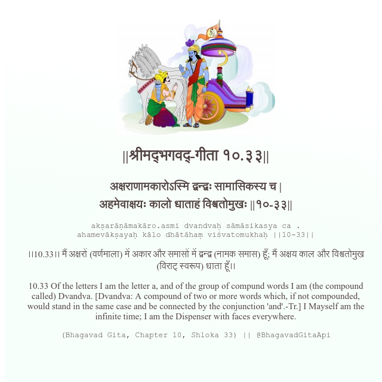

<h2>||श्रीमद्‍भगवद्‍-गीता १०.३३||</h2>
<h3>अक्षराणामकारोऽस्मि द्वन्द्वः सामासिकस्य च | अहमेवाक्षयः कालो धाताहं विश्वतोमुखः ||१०-३३||</h3>
<pre>akṣarāṇāmakāro.asmi dvandvaḥ sāmāsikasya ca . ahamevākṣayaḥ kālo dhātāhaṃ viśvatomukhaḥ ||10-33||</pre>

।।10.33।। मैं अक्षरों (वर्णमाला) में अकार और समासों में द्वन्द्व (नामक समास) हूँ; मैं अक्षय काल और विश्वतोमुख (विराट् स्वरूप) धाता हूँ।।

<pre>(Bhagavad Gita, Chapter 10, Shloka 33) || @BhagavadGitaApi</pre>
https://docs.bhagavadgitaapi.in/

#API #bhagavadgitaapi #slok #nodejs #js #api #gitaapi #krishna #hinduism #vedic #ISKCON #shreemadbhagavadgita #technology

