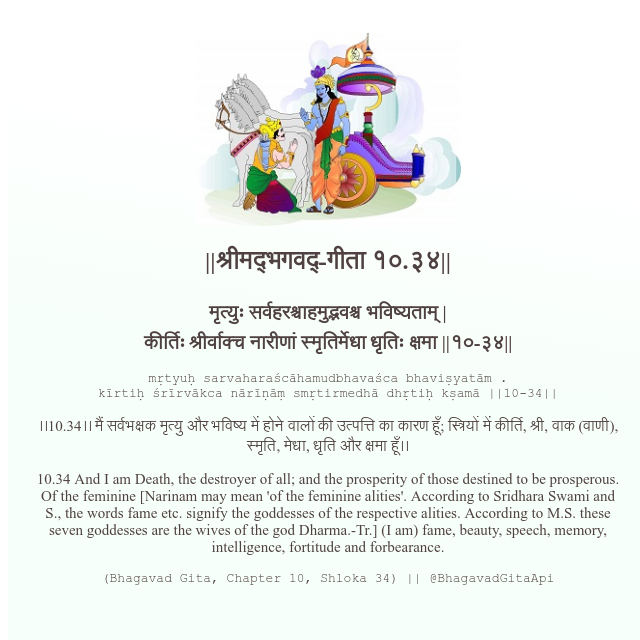

<h2>||श्रीमद्‍भगवद्‍-गीता १०.३४||</h2>
<h3>मृत्युः सर्वहरश्चाहमुद्भवश्च भविष्यताम् | कीर्तिः श्रीर्वाक्च नारीणां स्मृतिर्मेधा धृतिः क्षमा ||१०-३४||</h3>
<pre>mṛtyuḥ sarvaharaścāhamudbhavaśca bhaviṣyatām . kīrtiḥ śrīrvākca nārīṇāṃ smṛtirmedhā dhṛtiḥ kṣamā ||10-34||</pre>

।।10.34।। मैं सर्वभक्षक मृत्यु और भविष्य में होने वालों की उत्पत्ति का कारण हूँ; स्त्रियों में कीर्ति, श्री, वाक (वाणी), स्मृति, मेधा, धृति और क्षमा हूँ।।

<pre>(Bhagavad Gita, Chapter 10, Shloka 34) || @BhagavadGitaApi</pre>
https://bhagavadgitaapi.in/

#API #bhagavadgitaapi #slok #nodejs #js #api #gitaapi #krishna #hinduism #vedic #ISKCON #shreemadbhagavadgita #technology

