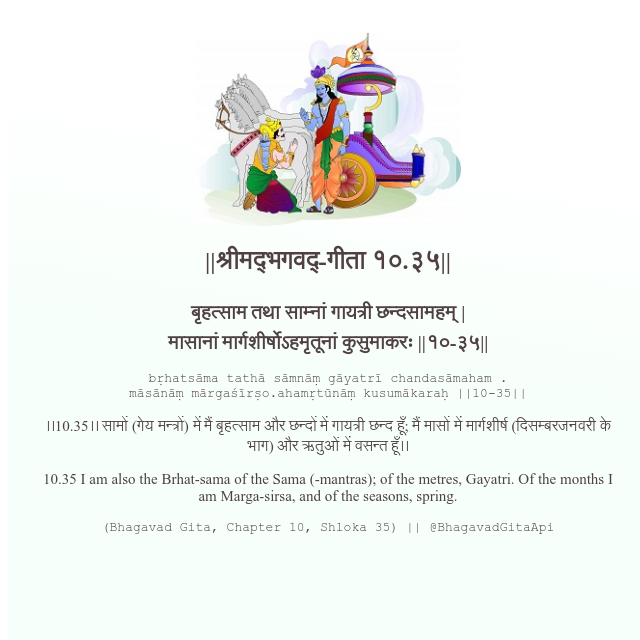

<h2>||श्रीमद्‍भगवद्‍-गीता १०.३५||</h2>
<h3>बृहत्साम तथा साम्नां गायत्री छन्दसामहम् | मासानां मार्गशीर्षोऽहमृतूनां कुसुमाकरः ||१०-३५||</h3>
<pre>bṛhatsāma tathā sāmnāṃ gāyatrī chandasāmaham . māsānāṃ mārgaśīrṣo.ahamṛtūnāṃ kusumākaraḥ ||10-35||</pre>

।।10.35।। सामों (गेय मन्त्रों) में मैं बृहत्साम और छन्दों में गायत्री छन्द हूँ; मैं मासों में मार्गशीर्ष (दिसम्बरजनवरी के भाग) और ऋतुओं में वसन्त हूँ।।

<pre>(Bhagavad Gita, Chapter 10, Shloka 35) || @BhagavadGitaApi</pre>
https://vedicscriptures.github.io/

#API #bhagavadgitaapi #slok #nodejs #js #api #gitaapi #krishna #hinduism #vedic #ISKCON #shreemadbhagavadgita #technology

