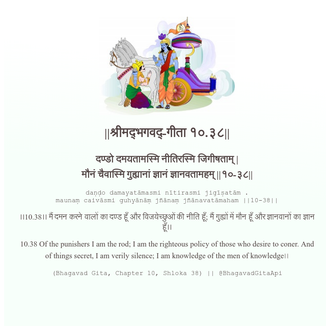

<h2>||श्रीमद्‍भगवद्‍-गीता १०.३८||</h2>
<h3>दण्डो दमयतामस्मि नीतिरस्मि जिगीषताम् | मौनं चैवास्मि गुह्यानां ज्ञानं ज्ञानवतामहम् ||१०-३८||</h3>
<pre>daṇḍo damayatāmasmi nītirasmi jigīṣatām . maunaṃ caivāsmi guhyānāṃ jñānaṃ jñānavatāmaham ||10-38||</pre>

।।10.38।। मैं दमन करने वालों का दण्ड हूँ और विजयेच्छुओं की नीति हूँ; मैं गुह्यों में मौन हूँ और ज्ञानवानों का ज्ञान हूँ।।

<pre>(Bhagavad Gita, Chapter 10, Shloka 38) || @BhagavadGitaApi</pre>
https://vedicscriptures.github.io/

#API #bhagavadgitaapi #slok #nodejs #js #api #gitaapi #krishna #hinduism #vedic #ISKCON #shreemadbhagavadgita #technology

