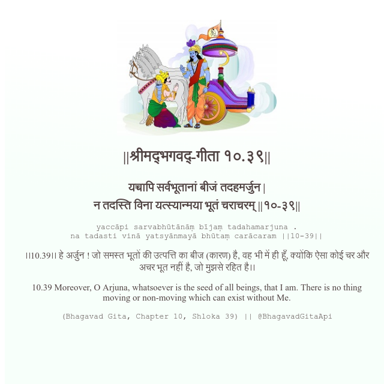

<h2>||श्रीमद्‍भगवद्‍-गीता १०.३९||</h2>
<h3>यच्चापि सर्वभूतानां बीजं तदहमर्जुन | न तदस्ति विना यत्स्यान्मया भूतं चराचरम् ||१०-३९||</h3>
<pre>yaccāpi sarvabhūtānāṃ bījaṃ tadahamarjuna . na tadasti vinā yatsyānmayā bhūtaṃ carācaram ||10-39||</pre>

।।10.39।। हे अर्जुन ! जो समस्त भूतों की उत्पत्ति का बीज (कारण) है, वह भी में ही हूँ, क्योंकि ऐसा कोई चर और अचर भूत नहीं है, जो मुझसे रहित है।।

<pre>(Bhagavad Gita, Chapter 10, Shloka 39) || @BhagavadGitaApi</pre>
https://docs.bhagavadgitaapi.in/

#API #bhagavadgitaapi #slok #nodejs #js #api #gitaapi #krishna #hinduism #vedic #ISKCON #shreemadbhagavadgita #technology

