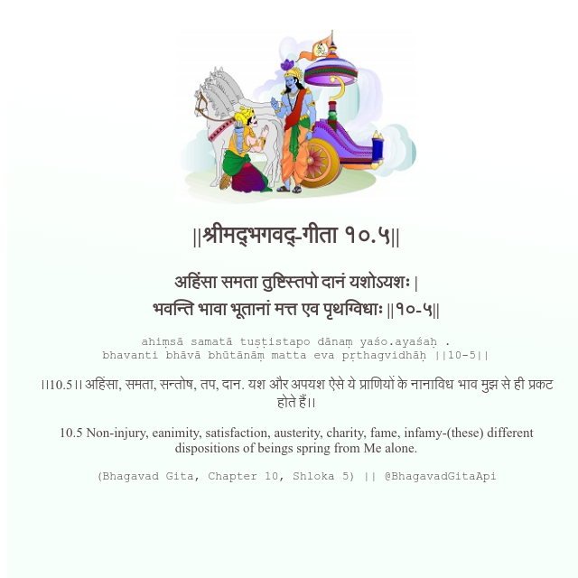

<h2>||श्रीमद्‍भगवद्‍-गीता १०.५||</h2>
<h3>अहिंसा समता तुष्टिस्तपो दानं यशोऽयशः | भवन्ति भावा भूतानां मत्त एव पृथग्विधाः ||१०-५||</h3>
<pre>ahiṃsā samatā tuṣṭistapo dānaṃ yaśo.ayaśaḥ . bhavanti bhāvā bhūtānāṃ matta eva pṛthagvidhāḥ ||10-5||</pre>

।।10.5।। अहिंसा, समता, सन्तोष, तप, दान. यश और अपयश ऐसे ये प्राणियों के नानाविध भाव मुझ से ही प्रकट होते हैं।।

<pre>(Bhagavad Gita, Chapter 10, Shloka 5) || @BhagavadGitaApi</pre>
https://bhagavadgitaapi.in/

#API #bhagavadgitaapi #slok #nodejs #js #api #gitaapi #krishna #hinduism #vedic #ISKCON #shreemadbhagavadgita #technology

