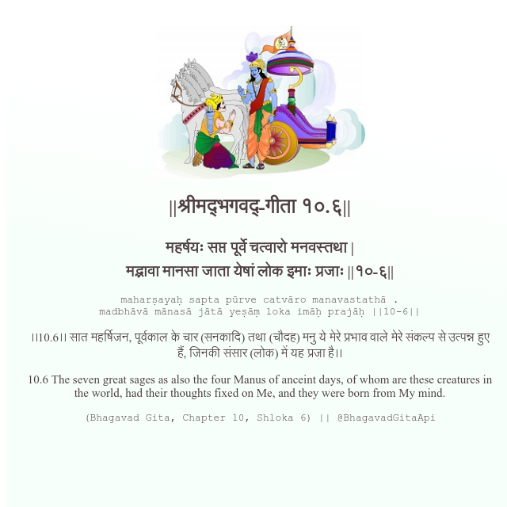

<h2>||श्रीमद्‍भगवद्‍-गीता १०.६||</h2>
<h3>महर्षयः सप्त पूर्वे चत्वारो मनवस्तथा | मद्भावा मानसा जाता येषां लोक इमाः प्रजाः ||१०-६||</h3>
<pre>maharṣayaḥ sapta pūrve catvāro manavastathā . madbhāvā mānasā jātā yeṣāṃ loka imāḥ prajāḥ ||10-6||</pre>

।।10.6।। सात महर्षिजन, पूर्वकाल के चार (सनकादि) तथा (चौदह) मनु ये मेरे प्रभाव वाले मेरे संकल्प से उत्पन्न हुए हैं, जिनकी संसार (लोक) में यह प्रजा है।।

<pre>(Bhagavad Gita, Chapter 10, Shloka 6) || @BhagavadGitaApi</pre>
https://docs.bhagavadgitaapi.in/

#API #bhagavadgitaapi #slok #nodejs #js #api #gitaapi #krishna #hinduism #vedic #ISKCON #shreemadbhagavadgita #technology

