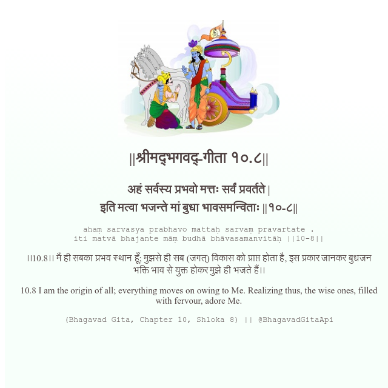

<h2>||श्रीमद्‍भगवद्‍-गीता १०.८||</h2>
<h3>अहं सर्वस्य प्रभवो मत्तः सर्वं प्रवर्तते | इति मत्वा भजन्ते मां बुधा भावसमन्विताः ||१०-८||</h3>
<pre>ahaṃ sarvasya prabhavo mattaḥ sarvaṃ pravartate . iti matvā bhajante māṃ budhā bhāvasamanvitāḥ ||10-8||</pre>

।।10.8।। मैं ही सबका प्रभव स्थान हूँ; मुझसे ही सब (जगत्) विकास को प्राप्त होता है, इस प्रकार जानकर बुधजन भक्ति भाव से युक्त होकर मुझे ही भजते हैं।।

<pre>(Bhagavad Gita, Chapter 10, Shloka 8) || @BhagavadGitaApi</pre>
https://vedicscriptures.github.io/

#API #bhagavadgitaapi #slok #nodejs #js #api #gitaapi #krishna #hinduism #vedic #ISKCON #shreemadbhagavadgita #technology

