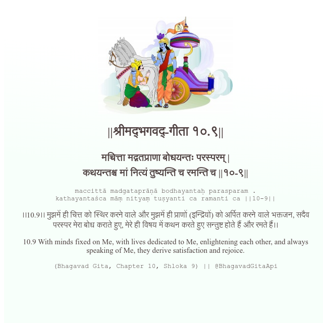

<h2>||श्रीमद्‍भगवद्‍-गीता १०.९||</h2>
<h3>मच्चित्ता मद्गतप्राणा बोधयन्तः परस्परम् | कथयन्तश्च मां नित्यं तुष्यन्ति च रमन्ति च ||१०-९||</h3>
<pre>maccittā madgataprāṇā bodhayantaḥ parasparam . kathayantaśca māṃ nityaṃ tuṣyanti ca ramanti ca ||10-9||</pre>

।।10.9।। मुझमें ही चित्त को स्थिर करने वाले और मुझमें ही प्राणों (इन्द्रियों) को अर्पित करने वाले भक्तजन, सदैव परस्पर मेरा बोध कराते हुए, मेरे ही विषय में कथन करते हुए सन्तुष्ट होते हैं और रमते हैं।।

<pre>(Bhagavad Gita, Chapter 10, Shloka 9) || @BhagavadGitaApi</pre>
https://docs.bhagavadgitaapi.in/

#API #bhagavadgitaapi #slok #nodejs #js #api #gitaapi #krishna #hinduism #vedic #ISKCON #shreemadbhagavadgita #technology

