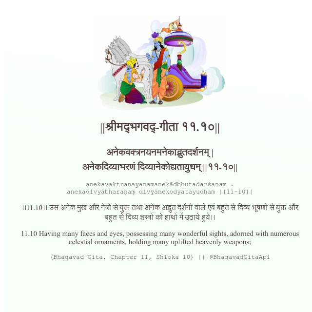

<h2>||श्रीमद्‍भगवद्‍-गीता ११.१०||</h2>
<h3>अनेकवक्त्रनयनमनेकाद्भुतदर्शनम् | अनेकदिव्याभरणं दिव्यानेकोद्यतायुधम् ||११-१०||</h3>
<pre>anekavaktranayanamanekādbhutadarśanam . anekadivyābharaṇaṃ divyānekodyatāyudham ||11-10||</pre>

।।11.10।। उस अनेक मुख और नेत्रों से युक्त तथा अनेक अद्भुत दर्शनों वाले एवं बहुत से दिव्य भूषणों से युक्त और बहुत से दिव्य शस्त्रों को हाथों में उठाये हुये।।

<pre>(Bhagavad Gita, Chapter 11, Shloka 10) || @BhagavadGitaApi</pre>
https://vedicscriptures.github.io/

#API #bhagavadgitaapi #slok #nodejs #js #api #gitaapi #krishna #hinduism #vedic #ISKCON #shreemadbhagavadgita #technology

